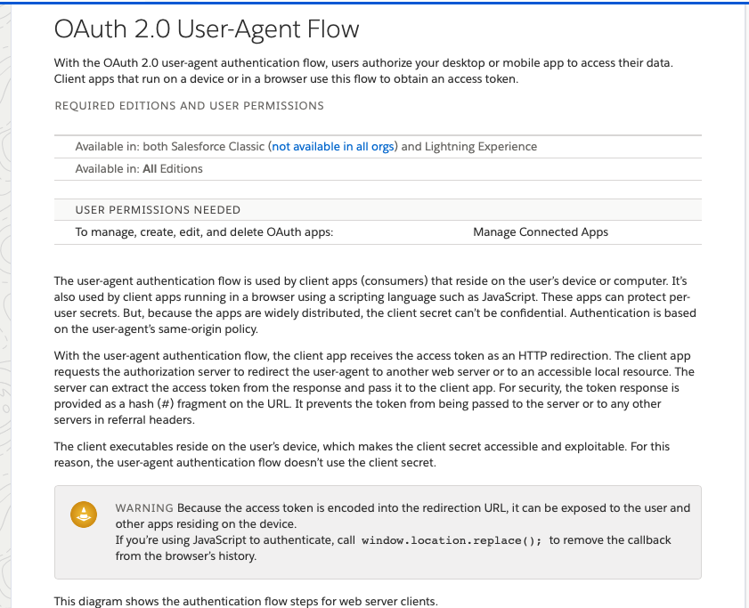
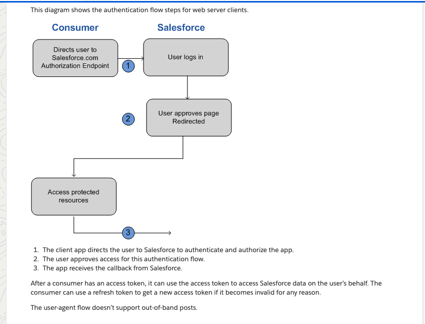
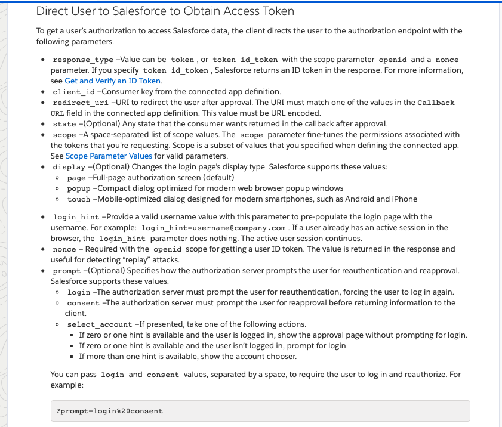
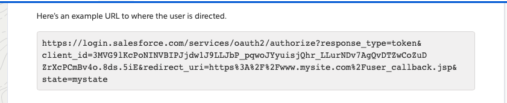
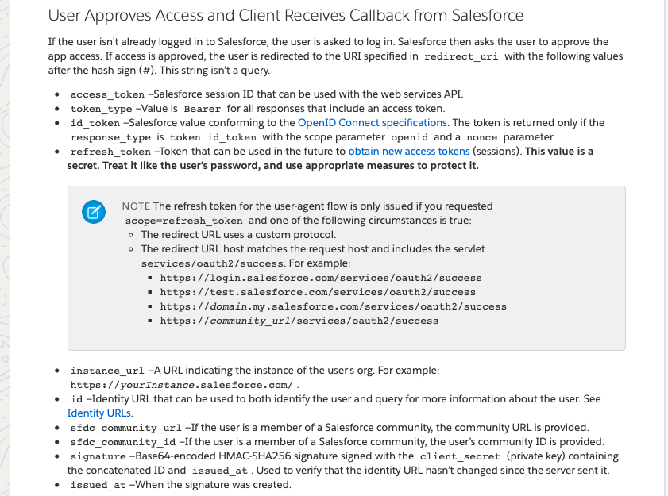
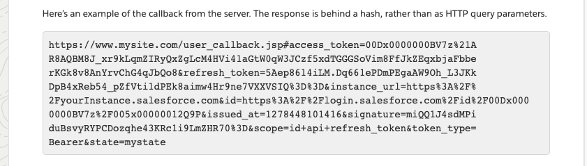
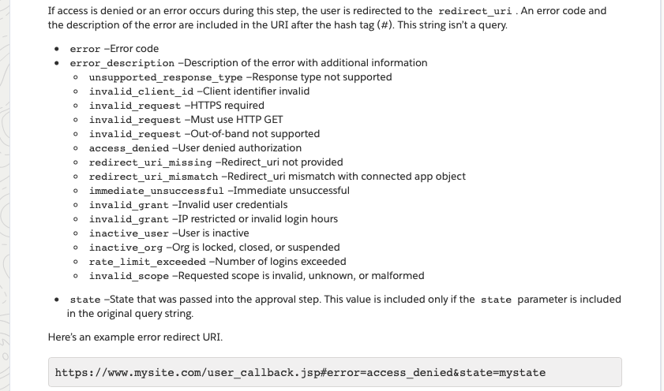
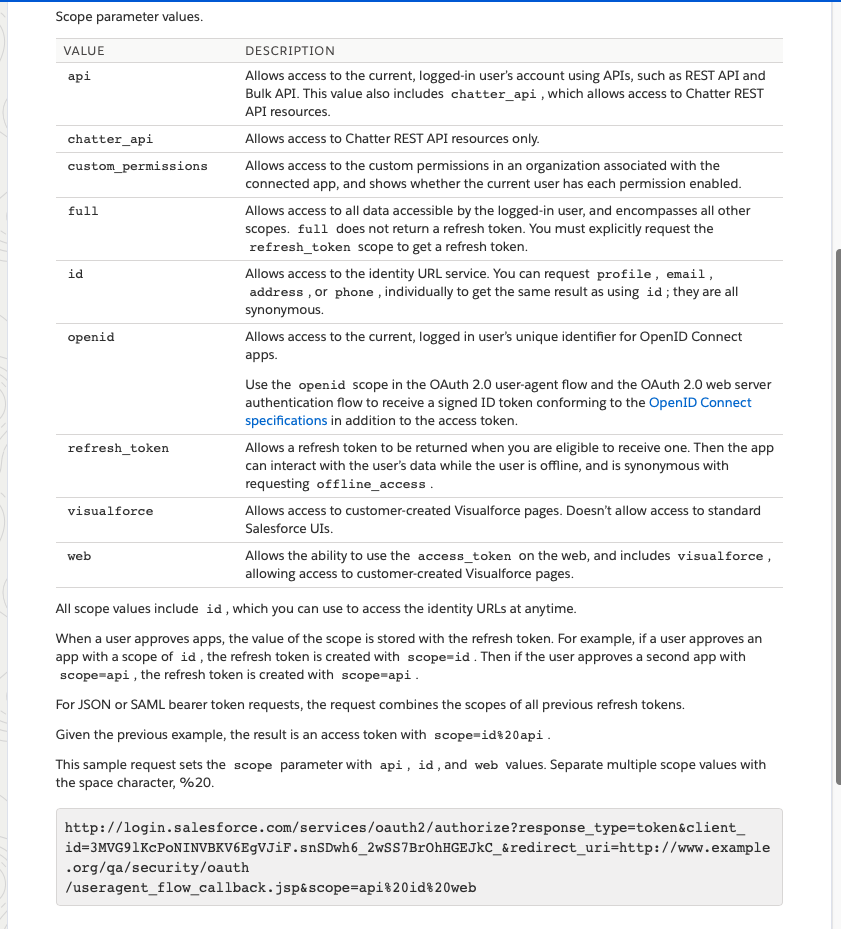

#SimpleSalesforce

Provides a simplistic use and use case using Salesfore Communities with a [Xamarin.Forms WebView](https://docs.microsoft.com/en-us/xamarin/xamarin-forms/user-interface/webview?tabs=windows).

The current Salesforce Reference links

* [OAuth 2.0 User-Agent Flow](https://help.salesforce.com/articleView?id=remoteaccess_oauth_user_agent_flow.htm&type=5)
* [Scope Parameter Values](https://help.salesforce.com/articleView?id=remoteaccess_oauth_scopes.htm&type=5)

At the time of this code writing the following are the screen shots from the documentation from the Salesforce Links above.

**Scope Parameters Documentation**

